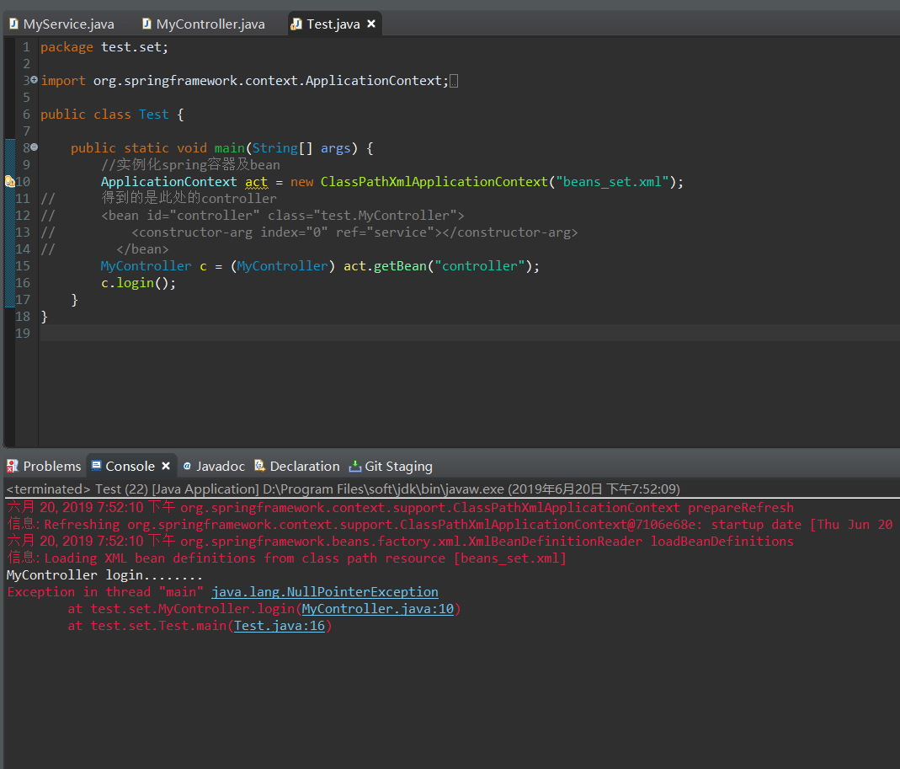
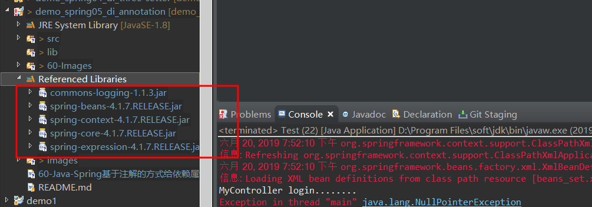
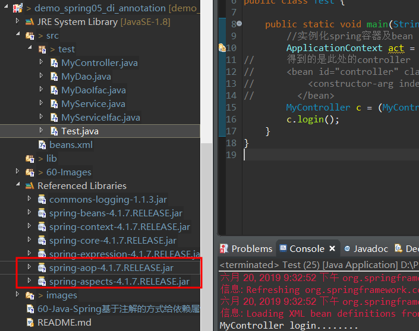
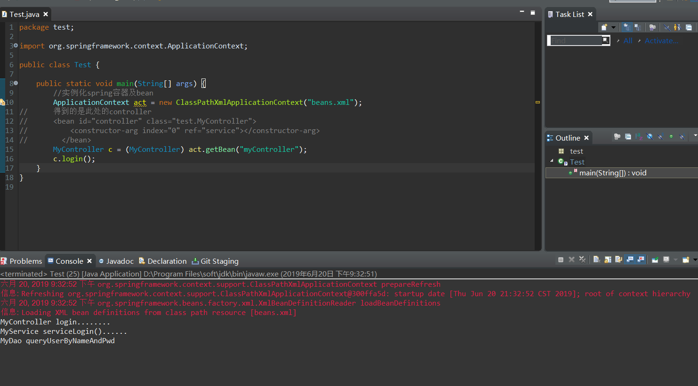

# Java-Spring基于注解的方式给依赖属性赋值

*沿用上一个项目*

1. 注释掉属性的set/get方法，并运行测试，如图所示测试失败



**结论：** 根据类型自动装配还是需要配置属性的get/set方法

2. 还原被注释掉的属性的set/get方法

3. 新建一个Java Project命名为 demo_spring05_di_annotation

4. 导入对应的jar包



5. 写对应层的类 以及配置beans.xml

**MyController**

```
package test;

public class MyController {

	private MyServiceIfac service;
	
	public MyController(MyServiceIfac myService)
	{
		this.service = myService;
	}
	public void login() 
	{
		System.out.println("MyController login........");
		service.serviceLogin();
	}
}
```

**MyDao**

```
package test;

public class MyDao implements MyDaoIfac {

	/* (non-Javadoc)  
	 * <p>Title: queryUserByNameAndPwd</p>  
	 * <p>Description: </p>    
	 * @see test.MyDaoIfac#queryUserByNameAndPwd()  
	 */
	@Override
	public void queryUserByNameAndPwd() 
	{
		System.out.println("MyDao queryUserByNameAndPwd");
	}
}
```

**MyDaoIfac**

```
package test;

public interface MyDaoIfac {

	void queryUserByNameAndPwd();

}
```
**MyService**

```
package test;

public class MyService implements MyServiceIfac {

	private MyDaoIfac dao;//MyService依赖MyDao
	/**
	 * 为咯给属性赋值 就在属性所在的
	 * 类里面设置一个构造方法
	 * 并且该构造方法接收一个该属性类开的参数
	 * <p>Title: </p>  
	 * <p>Description: </p>  
	 * @param myDao
	 */
	public MyService(MyDaoIfac myDao)
	{
		this.dao = myDao;
	}
	/* (non-Javadoc)  
	 * <p>Title: serviceLogin</p>  
	 * <p>Description: </p>    
	 * @see test.MyServiceIfac#serviceLogin()  
	 */
	@Override
	public void serviceLogin() {
		System.out.println("MyService serviceLogin()......");
		dao.queryUserByNameAndPwd();
	}
}
```
**MyService**

```
package test;

public class MyService implements MyServiceIfac {

	private MyDaoIfac dao;//MyService依赖MyDao
	/**
	 * 为咯给属性赋值 就在属性所在的
	 * 类里面设置一个构造方法
	 * 并且该构造方法接收一个该属性类开的参数
	 * <p>Title: </p>  
	 * <p>Description: </p>  
	 * @param myDao
	 */
	public MyService(MyDaoIfac myDao)
	{
		this.dao = myDao;
	}
	/* (non-Javadoc)  
	 * <p>Title: serviceLogin</p>  
	 * <p>Description: </p>    
	 * @see test.MyServiceIfac#serviceLogin()  
	 */
	@Override
	public void serviceLogin() {
		System.out.println("MyService serviceLogin()......");
		dao.queryUserByNameAndPwd();
	}
}
```
**MyServiceIfac**

```
package test;

public interface MyServiceIfac {

	void serviceLogin();

}
```
**Test测试类**

```
package test;

import org.springframework.context.ApplicationContext;
import org.springframework.context.support.ClassPathXmlApplicationContext;

public class Test {

	public static void main(String[] args) {
		//实例化spring容器及bean
		ApplicationContext act = new ClassPathXmlApplicationContext("beans.xml");
//		得到的是此处的controller
//	    <bean id="controller" class="test.MyController">
//			<constructor-arg index="0" ref="service"></constructor-arg>
//        </bean>
		MyController c = (MyController) act.getBean("controller");
		c.login();
	}
}
```
**beans.xml**

```
<?xml version="1.0" encoding="UTF-8"?>

<beans xmlns="http://www.springframework.org/schema/beans"
       xmlns:xsi="http://www.w3.org/2001/XMLSchema-instance" xmlns:tx="http://www.springframework.org/schema/tx"
       xmlns:context="http://www.springframework.org/schema/context"
       xsi:schemaLocation="http://www.springframework.org/schema/beans 
       http://www.springframework.org/schema/beans/spring-beans.xsd 
       http://www.springframework.org/schema/tx 
       http://www.springframework.org/schema/tx/spring-tx.xsd 
       http://www.springframework.org/schema/context 
       http://www.springframework.org/schema/context/spring-context.xsd">
  <!--      先配置最底层的Dao -->
       <bean id="dao" class="test.MyDao"></bean>
       <bean id="service" class="test.MyService">
<!--        构造函数注入     constructor-arg:构造器-参数 -->
			<constructor-arg index="0" ref="dao"></constructor-arg>
       </bean>
       <bean id="controller" class="test.MyController">
       			<constructor-arg index="0" ref="service"></constructor-arg>
       </bean>
</beans>
```
6. 详细配置

+ 引入刚刚忘记引入的jar包



+ 为对应的类写入头（戴帽子）

**MyController**

```
package test;

import org.springframework.beans.factory.annotation.Autowired;
import org.springframework.stereotype.Controller;

@Controller
public class MyController {

	@Autowired//自动装配的意思 默认根据类型装配
	private MyServiceIfac service;
	
	/**
	 *  如果有一个类不知道属于哪一层的话就写@Component 表示组件的意思 
	 * <p>Title: login</p>  
	 * <p>Description: </p>
	 */
//	public MyController(MyServiceIfac myService)
//	{
//		this.service = myService;
//	}
	public void login() 
	{
		System.out.println("MyController login........");
		service.serviceLogin();
	}
}
```

**MyDao**

```
package test;

import org.springframework.stereotype.Repository;

//又有接口又有实现类 帽子给实现类带

@Repository
public class MyDao implements MyDaoIfac {

	/* (non-Javadoc)  
	 * <p>Title: queryUserByNameAndPwd</p>  
	 * <p>Description: </p>    
	 * @see test.MyDaoIfac#queryUserByNameAndPwd()  
	 */
	@Override
	public void queryUserByNameAndPwd() 
	{
		System.out.println("MyDao queryUserByNameAndPwd");
	}
}
```
**MyDaoIfac**

```
package test;

public interface MyDaoIfac {

	void queryUserByNameAndPwd();

}
```
**MyService**

```
package test;

import org.springframework.beans.factory.annotation.Autowired;
import org.springframework.stereotype.Service;//这是一个注解

@Service
public class MyService implements MyServiceIfac {

	@Autowired
	private MyDaoIfac dao;//MyService依赖MyDao
	/**
	 * 为咯给属性赋值 就在属性所在的
	 * 类里面设置一个构造方法
	 * 并且该构造方法接收一个该属性类开的参数
	 * <p>Title: </p>  
	 * <p>Description: </p>  
	 * @param myDao
	 */
//	public MyService(MyDaoIfac myDao)
//	{
//		this.dao = myDao;
//	}
	/* (non-Javadoc)  
	 * <p>Title: serviceLogin</p>  
	 * <p>Description: </p>    
	 * @see test.MyServiceIfac#serviceLogin()  
	 */
	@Override
	public void serviceLogin() {
		System.out.println("MyService serviceLogin()......");
		dao.queryUserByNameAndPwd();
	}
}
```

**MyServiceIfac**

```
package test;

public interface MyServiceIfac {

	void serviceLogin();

}
```

**Test类**

```
package test;

import org.springframework.context.ApplicationContext;
import org.springframework.context.support.ClassPathXmlApplicationContext;

public class Test {

	public static void main(String[] args) {
		//实例化spring容器及bean
		ApplicationContext act = new ClassPathXmlApplicationContext("beans.xml");
//		得到的是此处的controller
//	    <bean id="controller" class="test.MyController">
//			<constructor-arg index="0" ref="service"></constructor-arg>
//        </bean>
		MyController c = (MyController) act.getBean("myController");
		c.login();
	}
}
```
**beans.xml**

```
<?xml version="1.0" encoding="UTF-8"?>

<beans xmlns="http://www.springframework.org/schema/beans"
       xmlns:xsi="http://www.w3.org/2001/XMLSchema-instance" xmlns:tx="http://www.springframework.org/schema/tx"
       xmlns:context="http://www.springframework.org/schema/context"
       xsi:schemaLocation="http://www.springframework.org/schema/beans 
       http://www.springframework.org/schema/beans/spring-beans.xsd 
       http://www.springframework.org/schema/tx 
       http://www.springframework.org/schema/tx/spring-tx.xsd 
       http://www.springframework.org/schema/context 
       http://www.springframework.org/schema/context/spring-context.xsd">
       <!-- 
       	启动注解，全包扫描
       	base-package="com.ptcs.demo.dao"(基本包名 com.ptcs.demo)
       	base-package="com.ptcs.demo.control"
        -->
       <context:component-scan base-package="test"></context:component-scan>
</beans>
```

7. 测试;如图所示，测试成功;



**备注：** 
```
每一个类至少要有一个空的构造方法

使用注解的方式给依赖属性赋值非常方便：

1.不需要在xml文件中注册bean了；
2.不需要提供属性的setter/getter方法了；

如何使用注解开发：

1.导入aop相关的包

aop   aspect

2.在xml文件中开启全包扫描：
<!-- 启动注解，全包扫描 -->
	<context:component-scan base-package="test"></context:component-scan>

	
3.编写完bean的代码后，给bean带上帽子：@Service  @Controller  @Repository  @Component

4.还要给依赖的属性带上帽子： @Autowired  @Resource  
建议大家使用框架的时候后专心使用框架API，不要一边使用框架API，一边使用JavaAPI，所以使用@Autowired

@Autowired 默认按类型装配，
@Resource默认按名称装配，当找不到与名称匹配的bean才会按类型装配。
```

**以上就是我关于 Java-Spring基于注解的方式给依赖属性赋值 知识的整理与总结 另附上[源码地址](https://github.com/javaobjects/demo_spring05_di_annotation)**

==================================================================
#### 分割线
==================================================================

**博主为咯学编程：父母不同意学编程，现已断绝关系;恋人不同意学编程，现已分手;亲戚不同意学编程，现已断绝来往;老板不同意学编程,现已失业三十年。。。。。。如果此博文有帮到你欢迎打赏，金额不限。。。**

 