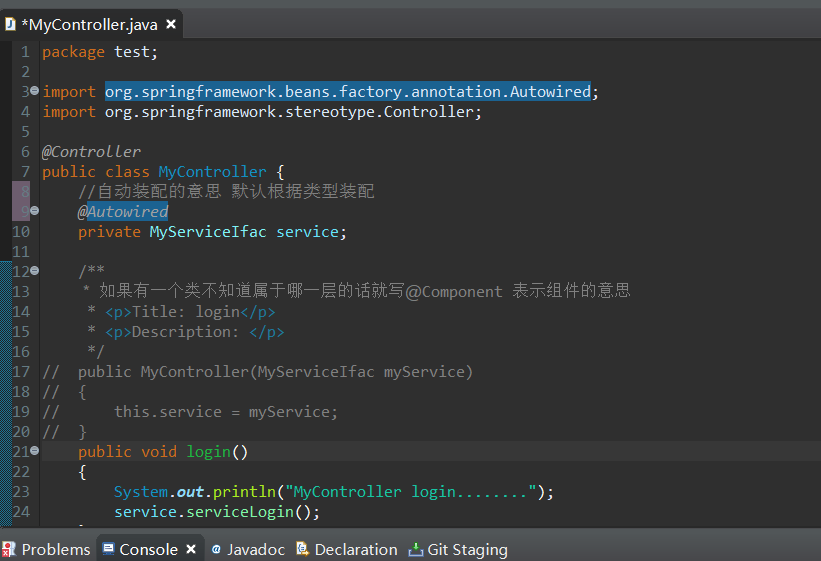
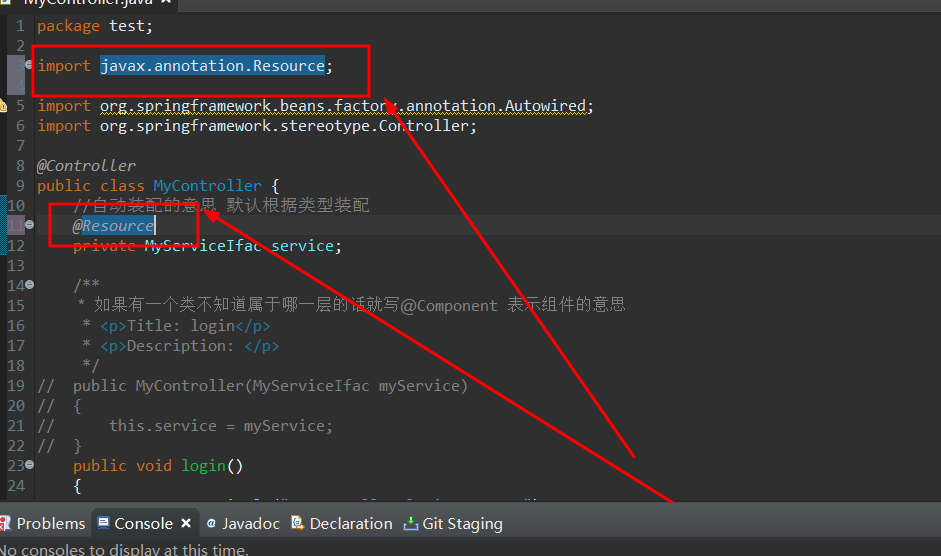
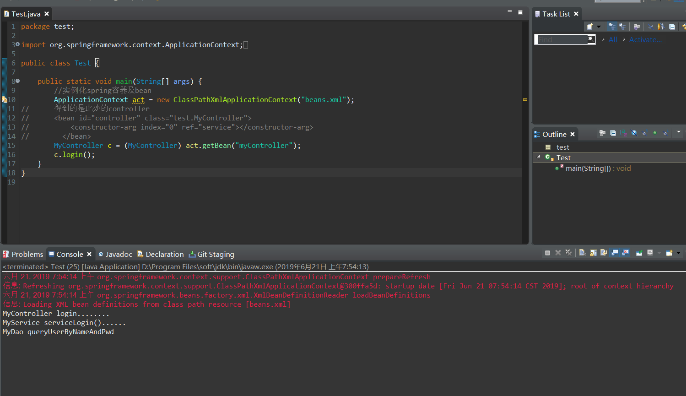
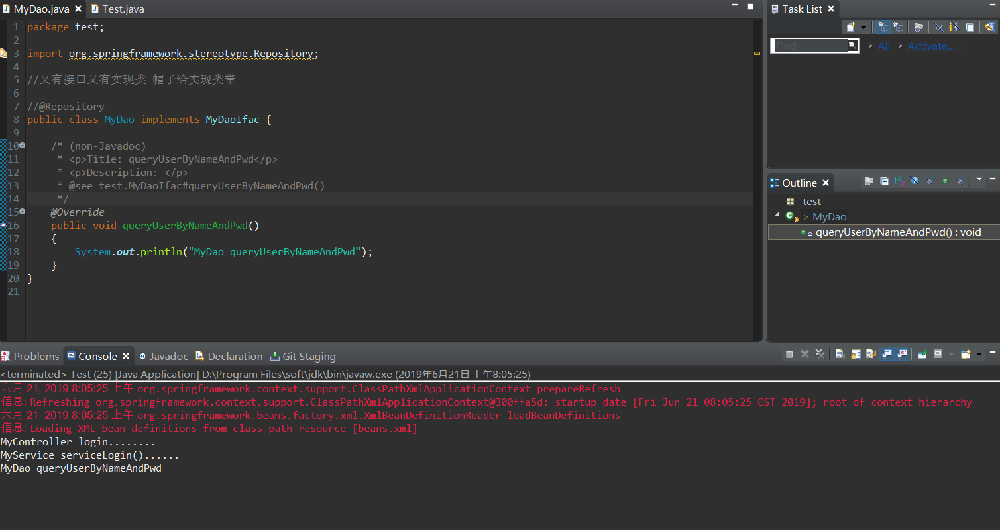

# Java-Spring两种自动装配@Autowired&@Resoure的区别

*沿用上一个项目*
1. 将@Autowired换成@Resoure



换成@Resoure之后



**从中可以看出 @utowired导入的包是Spring的包 而@Resoure导入的包是Java的包**

**若有这么一个需求 项目中都使用controller不再使用以前的servlet，禁止大家在controller里使用Java底层的API ，那么此时就理解成不使用用 @Resource 使用 @Autowired**

```
建议大家使用框架的时候后专心使用框架API，不要一边使用框架API，一边使用JavaAPI，所以使用@Autowired

@Autowired 默认根据类型装配
@Resource 默认根据名字装配
```

将 **MyController** 和 **MyService** 更改

```
package test;

import javax.annotation.Resource;

import org.springframework.stereotype.Service;//这是一个注解

@Service
public class MyService implements MyServiceIfac {

	@Resource
	private MyDaoIfac dao;//MyService依赖MyDao
	/**
	 * 为咯给属性赋值 就在属性所在的
	 * 类里面设置一个构造方法
	 * 并且该构造方法接收一个该属性类开的参数
	 * <p>Title: </p>  
	 * <p>Description: </p>  
	 * @param myDao
	 */
//	public MyService(MyDaoIfac myDao)
//	{
//		this.dao = myDao;
//	}
	/* (non-Javadoc)  
	 * <p>Title: serviceLogin</p>  
	 * <p>Description: </p>    
	 * @see test.MyServiceIfac#serviceLogin()  
	 */
	@Override
	public void serviceLogin() {
		System.out.println("MyService serviceLogin()......");
		dao.queryUserByNameAndPwd();
	}
}
```

```
package test;

import javax.annotation.Resource;

import org.springframework.stereotype.Controller;

@Controller
public class MyController {
	//自动装配的意思 默认根据类型装配
	@Resource
	private MyServiceIfac service;
	
	/**
	 *  如果有一个类不知道属于哪一层的话就写@Component 表示组件的意思 
	 * <p>Title: login</p>  
	 * <p>Description: </p>
	 */
//	public MyController(MyServiceIfac myService)
//	{
//		this.service = myService;
//	}
	public void login() 
	{
		System.out.println("MyController login........");
		service.serviceLogin();
	}
}
```

2. 测试运行,如图所示测试通过



问题：点解？@Resource不是根据名字找吗？

```
@Resource 默认按名称装配，当找不到与名称匹配的bean才会按类型装配
```

**拓展知识点：** 将MyDao里的帽子拿掉会发生什么？

```
package test;

import org.springframework.stereotype.Repository;

//又有接口又有实现类 帽子给实现类带

//@Repository
public class MyDao implements MyDaoIfac {

	/* (non-Javadoc)  
	 * <p>Title: queryUserByNameAndPwd</p>  
	 * <p>Description: </p>    
	 * @see test.MyDaoIfac#queryUserByNameAndPwd()  
	 */
	@Override
	public void queryUserByNameAndPwd() 
	{
		System.out.println("MyDao queryUserByNameAndPwd");
	}
}
```
**测试运行：** 



经我测试依然没有问题

**以就就是我关于 Java-Spring两种自动装配@Autowired&@Resoure的区别 知识点的总结**

==================================================================
#### 分割线
==================================================================

**博主为咯学编程：父母不同意学编程，现已断绝关系;恋人不同意学编程，现已分手;亲戚不同意学编程，现已断绝来往;老板不同意学编程,现已失业三十年。。。。。。如果此博文有帮到你欢迎打赏，金额不限。。。**

 


