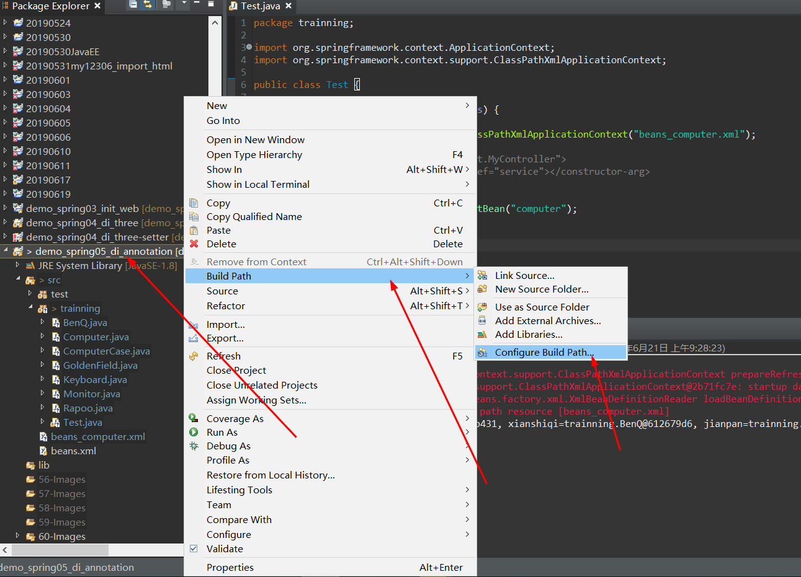
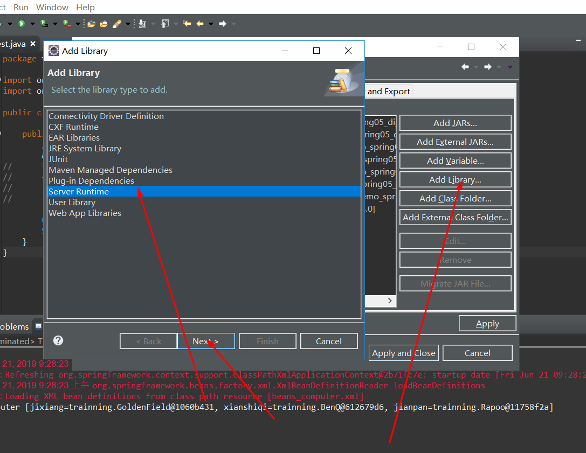

# Java-Spring使用注解配置自动装配电脑

**题目**

```
电脑爱好者会自己去电脑城组装电脑，我们用代码完成一台电脑的配置：
1）必须的配件（接口）：有机箱（包括所有内部组件）——ComputerCase、显示器——Monitor、键盘鼠标——Keyboard；
2）机箱品牌（实现类）：金和田——GoldenField、大水牛——Bubalus；
3）显示器品牌（实现类）：明基——BenQ、宏基——Acer；
4）键盘鼠标品牌（实现类）：雷柏——Rapoo、罗技——Logitech；

采用构造器注入的方式，实现在不修改Java代码的前提下，变更电脑配置的功能。
```

1. 新建包trainning

```
package trainning;

import org.springframework.stereotype.Component;

@Component
public class BenQ implements Monitor{

}
```

```
package trainning;


import org.springframework.beans.factory.annotation.Autowired;
import org.springframework.stereotype.Component;

/**
 * 电脑爱好者会自己去电脑城组装电脑，我们用代码完成一台电脑的配置：
1）必须的配件（接口）：有机箱（包括所有内部组件）——ComputerCase、显示器——Monitor、键盘鼠标——Keyboard；
2）机箱品牌（实现类）：金和田——GoldenField、大水牛——Bubalus；
3）显示器品牌（实现类）：明基——BenQ、宏基——Acer；
4）键盘鼠标品牌（实现类）：雷柏——Rapoo、罗技——Logitech；
 * 电脑实体类
* <p>Title: Computer</p>  
* <p>Description: </p>  
* @author xianxian 
* @date 2019年6月21日
 */
@Component
public class Computer {

	@Autowired
	private ComputerCase jixiang;
	@Autowired
	private Monitor xianshiqi;
	@Autowired
	private Keyboard jianpan;
	@Override
	public String toString() {
		return "Computer [jixiang=" + jixiang + ", xianshiqi=" + xianshiqi + ", jianpan=" + jianpan + "]";
	}
}
```

```
package trainning;

import org.springframework.stereotype.Component;

@Component
public interface ComputerCase {

}
```

```
package trainning;

import org.springframework.stereotype.Component;

@Component
public class GoldenField implements ComputerCase{

}
```

```
package trainning;

import org.springframework.stereotype.Component;

@Component
public interface Keyboard {

}
```

```
package trainning;


public interface Monitor {

}
```

```
package trainning;

import org.springframework.stereotype.Component;

@Component
public class Rapoo implements Keyboard {

}
```

```
package trainning;

import org.springframework.context.ApplicationContext;
import org.springframework.context.support.ClassPathXmlApplicationContext;

public class Test {

	public static void main(String[] args) {
		//实例化spring容器及bean
		ApplicationContext act = new ClassPathXmlApplicationContext("beans_computer.xml");
//		得到的是此处的controller
//	    <bean id="controller" class="test.MyController">
//			<constructor-arg index="0" ref="service"></constructor-arg>
//        </bean>

		Computer com = (Computer) act.getBean("computer");
		System.out.println(com);
	}
}
```

```
<?xml version="1.0" encoding="UTF-8"?>

<beans xmlns="http://www.springframework.org/schema/beans"
       xmlns:xsi="http://www.w3.org/2001/XMLSchema-instance" xmlns:tx="http://www.springframework.org/schema/tx"
       xmlns:context="http://www.springframework.org/schema/context"
       xsi:schemaLocation="http://www.springframework.org/schema/beans 
       http://www.springframework.org/schema/beans/spring-beans.xsd 
       http://www.springframework.org/schema/tx 
       http://www.springframework.org/schema/tx/spring-tx.xsd 
       http://www.springframework.org/schema/context 
       http://www.springframework.org/schema/context/spring-context.xsd">
       <!-- 
       	启动注解，全包扫描
       	base-package="com.ptcs.demo.dao"(基本包名 com.ptcs.demo)
       	base-package="com.ptcs.demo.control"
        -->
       <context:component-scan base-package="trainning"></context:component-scan>
</beans>
```
2. 测试，如图所示测试成功




**拓展测试**

```
package trainning;

import org.springframework.stereotype.Component;

@Component
public class Bubalus implements ComputerCase {

}
```
**运行测试，报错信息如下**


说明：违反唯一，容器里有多个bean不知道要哪一个

**解决：**
```
@Autowired @Qualifier("goldenField")//此处的值默认为首字母小写 
private ComputerCase jixiang;
```
**再次测试,如图所示测试成功**


**以就就是我关于  Java-Spring使用注解配置自动装配电脑 知识点的整理与总结的全部内容**

==================================================================
#### 分割线
==================================================================

**博主为咯学编程：父母不同意学编程，现已断绝关系;恋人不同意学编程，现已分手;亲戚不同意学编程，现已断绝来往;老板不同意学编程,现已失业三十年。。。。。。如果此博文有帮到你欢迎打赏，金额不限。。。**

 