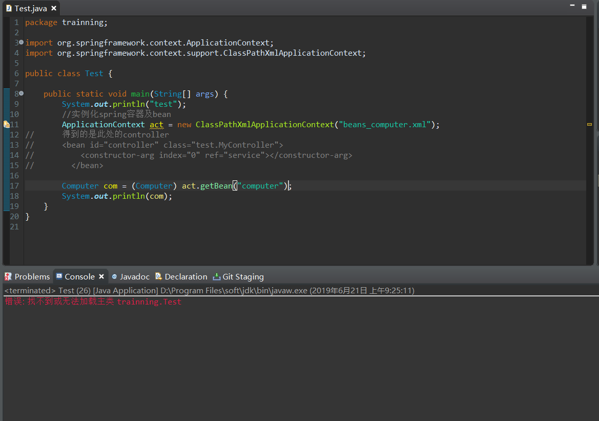
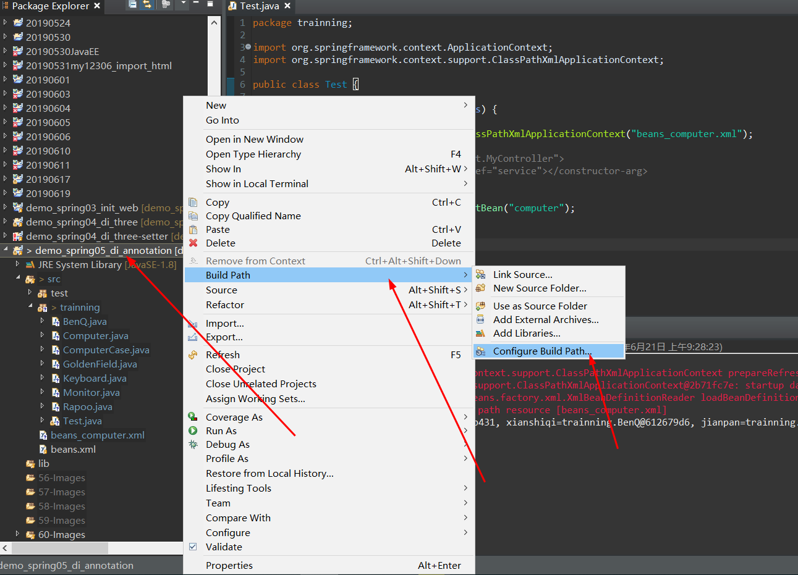
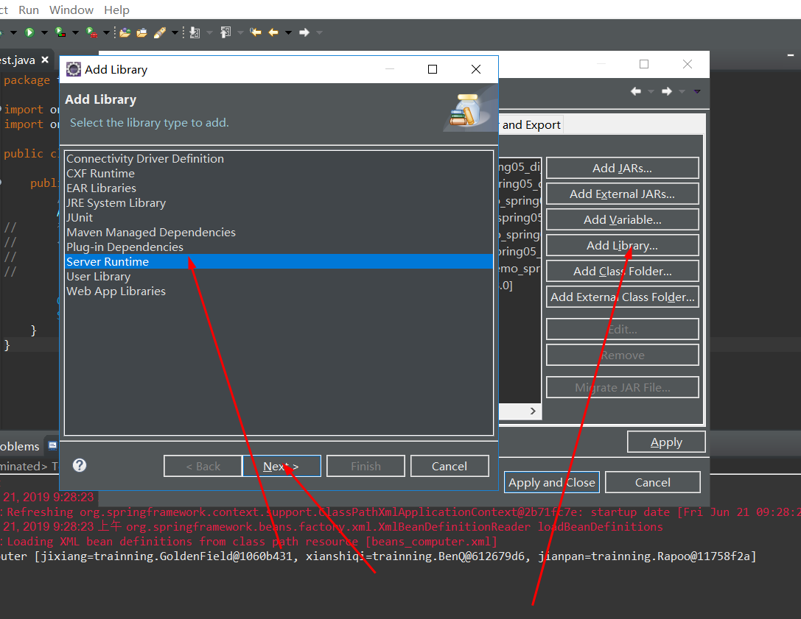
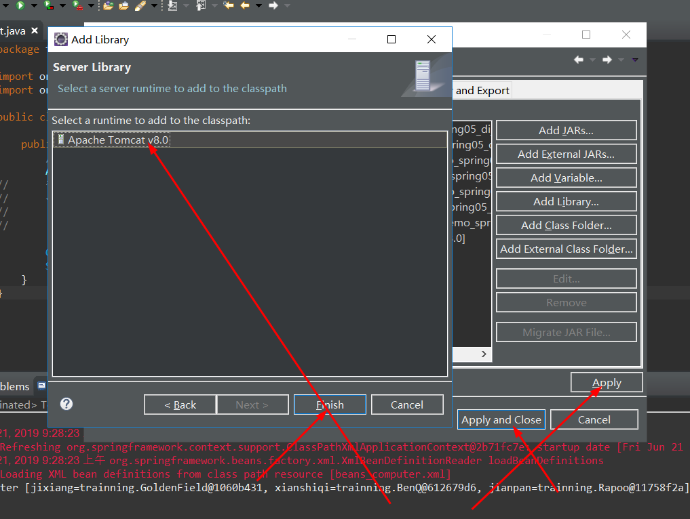
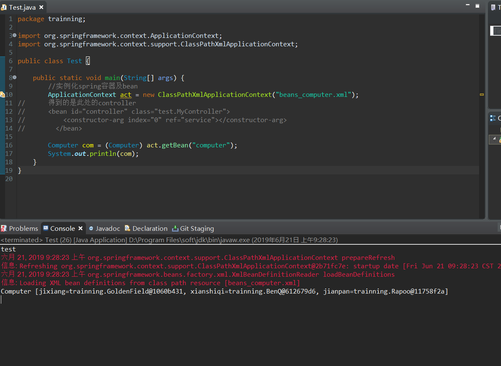

# Java-错误: 找不到或无法加载主类 XXX

```
错误: 找不到或无法加载主类 trainning.Test
```

报错信息如图所示：



**解决方法：**





**再次启动项目之后则动行成功**



**以就就是我关于 Java-错误: 找不到或无法加载主类 XXX 知识点的整理与总结的全部内容**

==================================================================
#### 分割线
==================================================================

**博主为咯学编程：父母不同意学编程，现已断绝关系;恋人不同意学编程，现已分手;亲戚不同意学编程，现已断绝来往;老板不同意学编程,现已失业三十年。。。。。。如果此博文有帮到你欢迎打赏，金额不限。。。**

 
